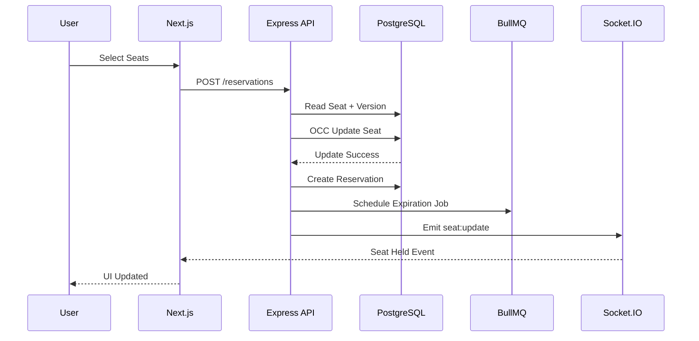
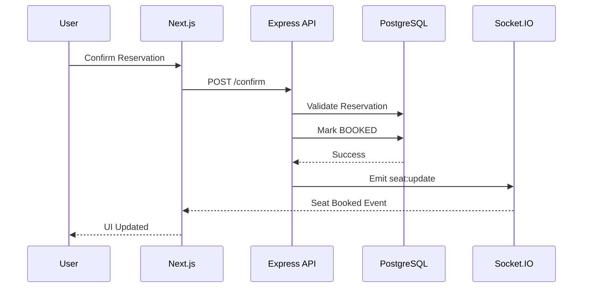
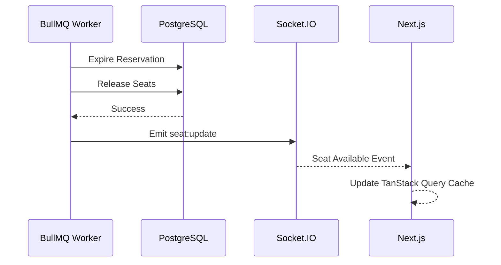

# Real-Time Ticket Booking System

A full-stack ticket booking platform supporting real-time seat synchronization, concurrency-safe reservations, and automated reservation expiration.

## Demo
- Live Demo

    - Frontend: (https://ticket-booking-frontend-ashen.vercel.app/)

    - Backend API Docs: (https://ticket-booking-backend-1-lppv.onrender.com/docs)

<!-- - Demo Video

    - <video_url> -->
## Features
1. Real-time seat updates using Socket.IO
2. Concurrency-safe seat reservation using Optimistic Concurrency Control (OCC)
3. Automated reservation expiration with BullMQ and Redis
4. PostgreSQL transactions for reservation consistency
5. Integration tested reservation workflows
6. Swagger API documentation

## Tech Stack
- ### Frontend
    - Next.js
    - React
    - TypeScript
    - TanStack Query
    - Socket.IO Client
    - Tailwind CSS
- ### Backend
    - Node.js
    - Express.js
    - TypeScript
    - Prisma ORM
    - PostgreSQL
    - Redis
    - BullMQ
    - Socket.IO

## Reservation Flow



## Booking Confirmation Flow



## Reservation Expiration Flow



## Concurrency Handling

To prevent double booking, the system uses Optimistic Concurrency Control.

``` ts
UPDATE seat
SET status='HELD',
    version=version+1
WHERE id=?
  AND version=?
  AND status='AVAILABLE';
```

If another reservation updates the seat first, the transaction fails and the reservation request is rejected.

## Tested Scenarios

1. Seat retrieval
2. Seat reservation
3. Reservation confirmation
4. Double booking prevention
5. Reservation expiration
6. Confirming expired reservations
7. Concurrent reservation attempt

## API Documentation

Swagger documentation is available at:

`
/docs
`

## Running Locally

### Backend

```bash
npm install
npm run dev
```

### Frontend

```bash
npm install
npm run dev
```

## Future Improvements

1. Google OAuth Authentication
2. User Booking History
3. Socket.IO Room-Based Broadcasting
4. Event Management Dashboard
5. Payment Integratio5