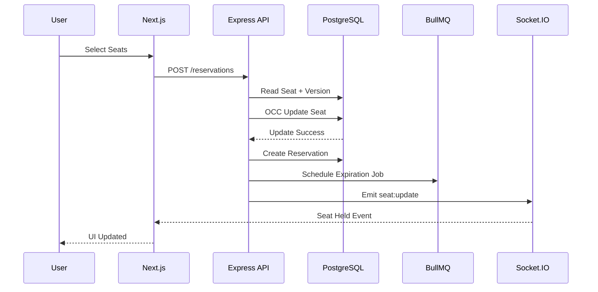
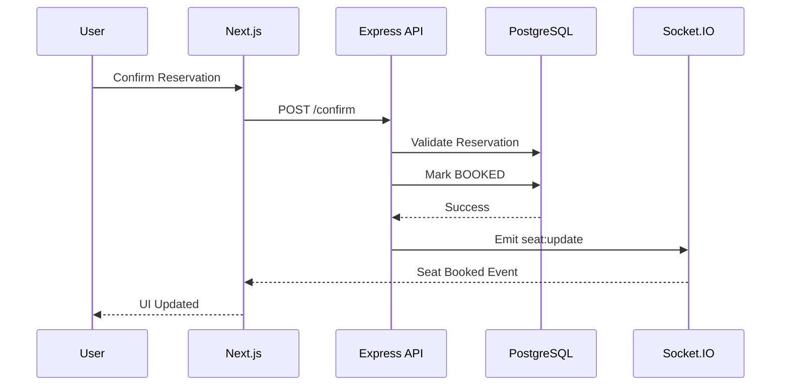
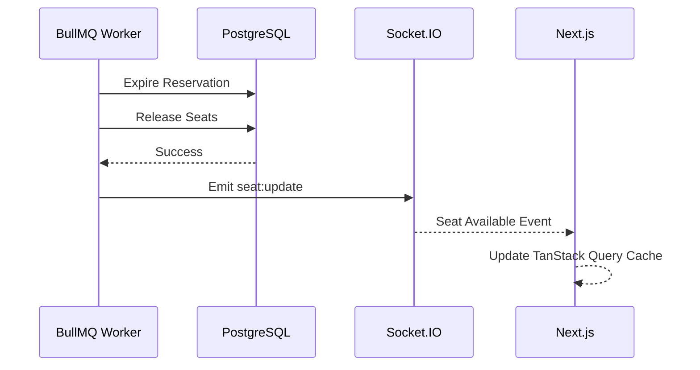
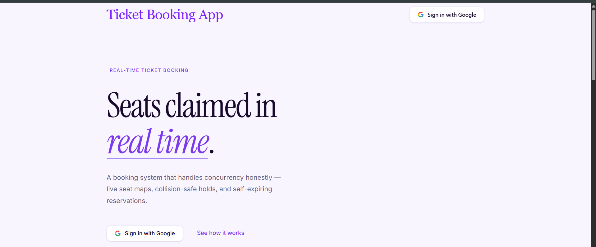
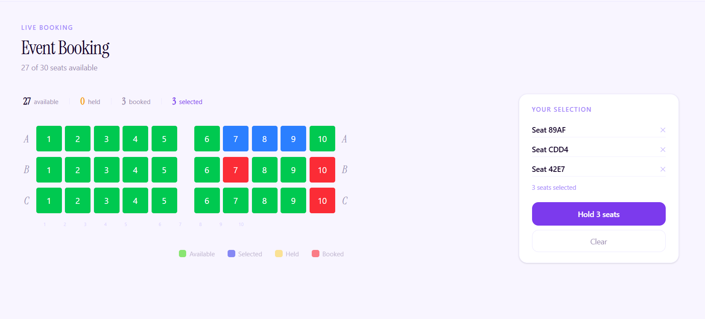
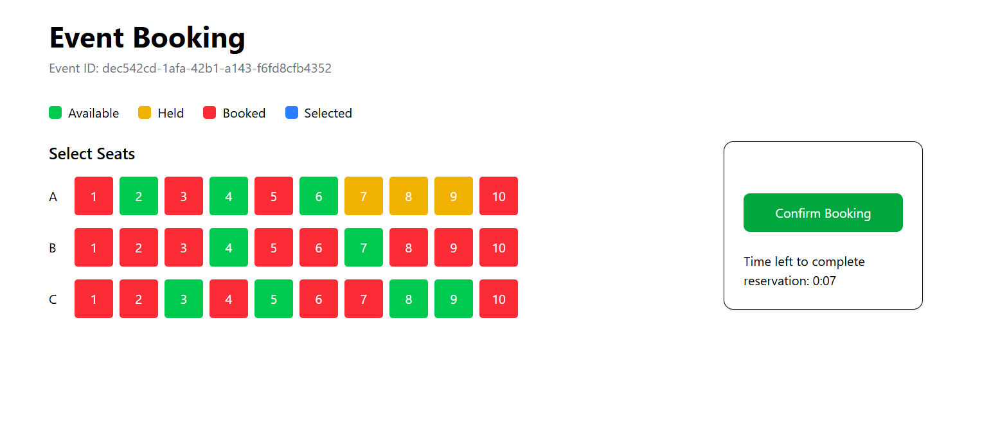
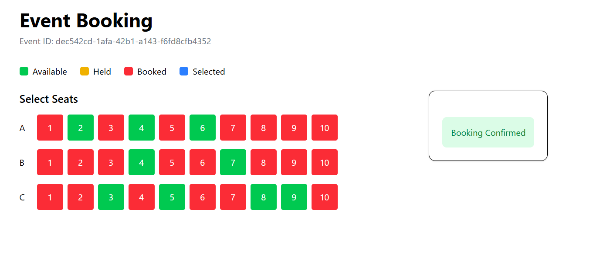
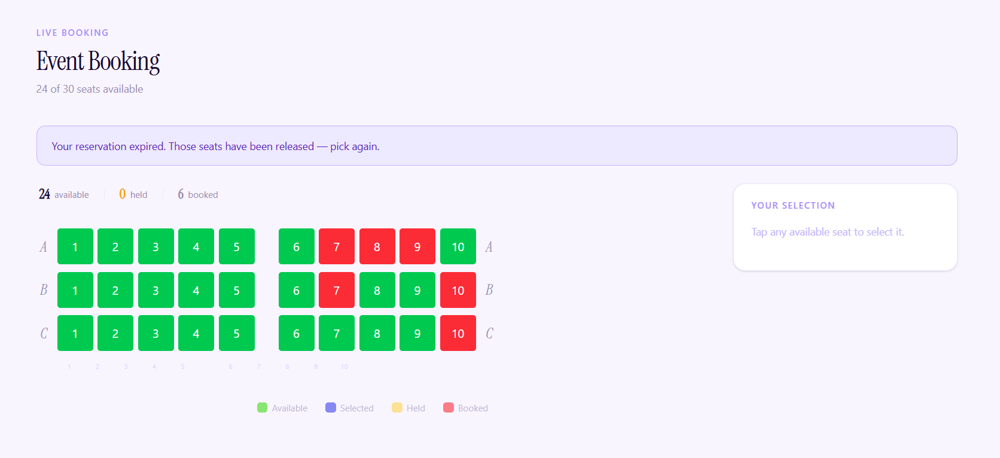

# Real-Time Ticket Booking System

A full-stack ticket booking platform supporting real-time seat synchronization, concurrency-safe reservations, and automated reservation expiration.

## Demo
- Live Demo

    - Frontend: (https://ticket-booking-frontend-ashen.vercel.app/)

    - Email API: (https://bg-processor.onrender.com)

    - Backend API Docs: (https://ticket-booking-backend-1-lppv.onrender.com/docs)

<!-- - Demo Video

    - <video_url> -->
## Features
1. Real-time seat updates using Socket.IO
2. Concurrency-safe seat reservation using Optimistic Concurrency Control (OCC)
3. Automated reservation expiration with BullMQ and Redis
4. PostgreSQL transactions for reservation consistency
5. Google OAuth authentication with JWT access tokens and rotating refresh token sessions 
6. Send Email Notification on Booking Success
7. Integration tested reservation workflows
8. Swagger API documentation

## Tech Stack
- ### Frontend
    - Next.js
    - React
    - TypeScript
    - TanStack Query
    - Socket.IO Client
    - Tailwind CSS
- ### Backend
    - Node.js
    - Express.js
    - TypeScript
    - Prisma ORM
    - PostgreSQL
    - Redis
    - BullMQ
    - Socket.IO

## Reservation Flow



## Booking Confirmation Flow



## Reservation Expiration Flow



## Concurrency Handling

To prevent double booking, the system uses Optimistic Concurrency Control.

``` ts
UPDATE seat
SET status='HELD',
    version=version+1
WHERE id=?
  AND version=?
  AND status='AVAILABLE';
```

If another reservation updates the seat first, the transaction fails and the reservation request is rejected.


## ScreenShots
### Landing


### Seat Selection



### Active Reservation



### Confirmed Booking



### Reservation Expiry



## Tested Scenarios

1. Seat retrieval
2. Seat reservation
3. Reservation confirmation
4. Double booking prevention
5. Reservation expiration
6. Confirming expired reservations
7. Concurrent reservation attempt

## API Documentation

Swagger documentation is available at:

`
/docs
`

## Running Locally

### 1. Clone the Repository

```bash
git clone <repository-url>
cd <repository-name>
```

### 2. Configure Environment Variables

Both the backend and frontend include a `.env.example` file.

#### Backend

```bash
cp .env.example .env
```

Update the values in `.env` with your own configuration.

#### Frontend

```bash
cp .env.example .env.local
```

Update the values in `.env.local` with your own configuration.

### 3. Install Dependencies

#### Backend

```bash
npm install
```

#### Frontend

```bash
npm install
```

### 4. Start the Development Servers

#### Backend

```bash
npm run dev
```

#### Frontend

```bash
npm run dev
```


## Future Improvements

1. User Booking History
2. Socket.IO Room-Based Broadcasting
3. Event Management Dashboard
4. Payment Integration